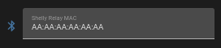

# Purpose and Outline

This Works by running a script on the shelly relay that transmits a BLE announcement which can be detected by an ESPHome Device. The initial goal of this is to allow a relay to be in "detached mode" and keep power to a smart bulb then on a toggle of input can send a signal via BLE directly to the bulb to toggle state. This means you are not dependent on a intermediary service such as Home Assistant to send the command .

## Requirements:
- A shelly Relay that has bluetooth support and which has at least firmware version 2.0. Gen3+ devices should be fine but some Gen2 devices may also work if they meet the requirements.
- An ESPHome Device that supports bluetooth (e.g. ESP32).
- Know the mac address of the Shelly relay's bluetooth adaptor (Can be found in the WebUI)

## Shelly Relay Setup
- On the Shelly relay's WebUI go to the Scripts section and press on "Create script"
- Name the script something appropriate
- Paste in the contents of the file `shelly-relay-script.mjs` in this repo into the code section
- OPTIONAL: If required for multiple input devices then change the `InputToAnnounce` variable used from 0 to another
- Press Save
- Press Run
- Return to the main page of the scripts section
- Toggle on "Run on startup" for the script

This will have the relay send out the following announcements:
- `init` - Script first started (useful for debugging)
- `on` - When the selected input is set to On
- `off` - When the selected input is set to Off

## ESPhome Device Config

- You now need to include the ESPHome config for this functionality to your devices config.

This can be done directly from this repo via remote package:

```
packages:
  shelly_relay_control: github://MichaelMKKelly/Shelly-and-ESPHome-BLE-Interaction-Tool-Kit/Shelly-Relay-Input-Announcer/shelly-relay-control.yml@main  
  ```

- Then you need to add a script called `input_change_actions` to put in your desried actions for what to happen when the state of the input changes:

```
script:
  - id: input_change_actions
    then:
      - switch.toggle:
          id: test_switch
```
Change `switch.toggle` in the example to whatever actions you want to run on a state change.

- OPTIONAL: You can set the default value of the relay mac address directly in the config via a substitution if you wish. It will remain changable via a text field inside of Home Assistant or by other method of changing text fields.

```
substitutions:
  default_shelly_relay_mac: AA:AA:AA:AA:AA:AA
```

- Compile and flash your firmware.

## Set Mac Address
You now need to set the text field for the mac address to the mac address of the Shelly relay's bluetooth adaptor.

Example in Home Assistant Device Page:



Example in `web_server`:


NB: If you set the default in the config in the optional step mentioned above then it should be already set to your correct MAC address.

## Debugging and/or more complicated setups
There is also an Event component that will report events of type `init` / `on` / `off` which can be used for more complicated or specific automations from Home Assistant. It is also good debugging tool.

## Example from Personal setup
```
packages:
  shelly_relay_control: github://MichaelMKKelly/Shelly-and-ESPHome-BLE-Interaction-Tool-Kit/Shelly-Relay-Input-Announcer/shelly-relay-control.yml@main
  
Script:
  - id: input_change_actions
    then:
      # Toggle Light status
      - light.toggle:
          id: rgbww_light
      # Wait for light to transition
      - delay: 1500ms
      # Check to see if light was switched on and set it to a default value
      - if:
          condition:
            lambda: 'return id(rgbww_light).current_values.is_on();'
          then:
            - logger.log: "was swtich on setting default"
            - light.turn_on:
                id: rgbww_light
                brightness: 90%
                color_temperature: 3800K
  ```